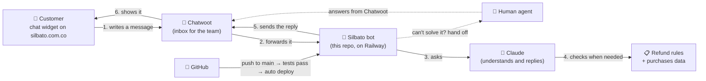

# Silbato AI Support Agent (MVP)

Chatwoot **Agent Bot** for Silbato's website widget. Answers basic business info, handles refund requests end to end with deterministic rules, and hands off to a human agent.

- Model: `claude-sonnet-5` with `effort: medium`, tool use, prompt caching on the system prompt.
- Conversation context: Chatwoot doesn't let bot tokens read message history, so the bot keeps it in memory (6 h, lost on redeploy).
- Business data is **fictional** (`knowledge/`, `config/`, `data/`).

## The big picture



In plain words:

1. A customer writes in the website chat. Chatwoot receives it and forwards it to the bot.
2. The bot asks Claude to understand the message and write a short, friendly answer, using only Silbato's info and refund policy.
3. For refunds, Claude looks up the purchase and checks the **fixed rules** (30 days, max $300.000, etc.). The rules decide, not the AI.
4. The bot replies in the chat. Approved refunds get a note for the team, who then return the money.
5. If the customer asks for a person, gets upset, or the case is out of policy, the bot passes the chat to a human in Chatwoot and stops replying.
6. Code changes go to GitHub. Once the tests pass, Railway deploys them automatically.

## How it works (technical)

```
Chatwoot ──POST /chatwoot/webhook?secret=…──▶ server.ts (200 immediately)
                                              │ filter.ts: only message_created + incoming + public + status pending, dedupe by id
                                              ▼
                                           handler.ts
                                              ├─ asks for agente/humano/asesor/persona? → handoff (no LLM)
                                              ├─ repeated question / >8 bot messages   → handoff
                                              └─ agent.ts (Claude tool loop, max 5)
                                                   tools.ts: lookup_customer_purchase, check_refund_eligibility (refund.ts),
                                                             submit_refund_decision, handoff_to_human
```

- **Handoff** = private note with summary + label `bot_handoff` + "Un agente te atenderá en breve." + `toggle_status: open`. Once open, the bot ignores the conversation. An agent can set it back to `pending` to return it to the bot.
- **Refunds**: eligibility comes from `config/refund_rules.json` in code, never from the LLM. `submit_refund_decision` re-checks the rules and refuses to record an approval that doesn't match. Approvals add label `refund_approved`, a private note for the team, a line in `data/refund_log.jsonl`, and resolve the conversation. **No money moves**; a human executes the refund from the label queue.
- **Identity**: purchases are only visible when their email matches the Chatwoot contact's email. If the contact has no email (enable the widget pre-chat form to collect it) or it doesn't match, the bot escalates.
- **Errors** (LLM or Chatwoot): polite fallback message + handoff.

## Env vars

| Var | Notes |
|---|---|
| `ANTHROPIC_API_KEY` | required |
| `ANTHROPIC_MODEL` | default `claude-sonnet-5` |
| `ANTHROPIC_EFFORT` | default `medium` |
| `CHATWOOT_URL` | e.g. `https://your-chatwoot.example.com` |
| `CHATWOOT_BOT_TOKEN` | access token of the Agent Bot |
| `CHATWOOT_USER_TOKEN` | optional; used for labels if the bot token gets 401/403 |
| `WEBHOOK_SECRET` | shared secret in the webhook URL |
| `PORT` | default 3000 (Railway sets it) |
| `DRY_RUN` | `true` logs Chatwoot calls instead of sending |

## Run

```bash
npm install
npm test
DRY_RUN=true WEBHOOK_SECRET=dev ANTHROPIC_API_KEY=… npm run dev
curl -X POST "localhost:3000/chatwoot/webhook?secret=dev" -H 'content-type: application/json' -d @test/fixtures/hours.json
```

## Limits (MVP)

- `data/refund_log.jsonl` lives on the container filesystem and is lost on redeploy; Chatwoot notes + labels are the durable record.
- Dedupe and fallback history are in memory (single instance).
